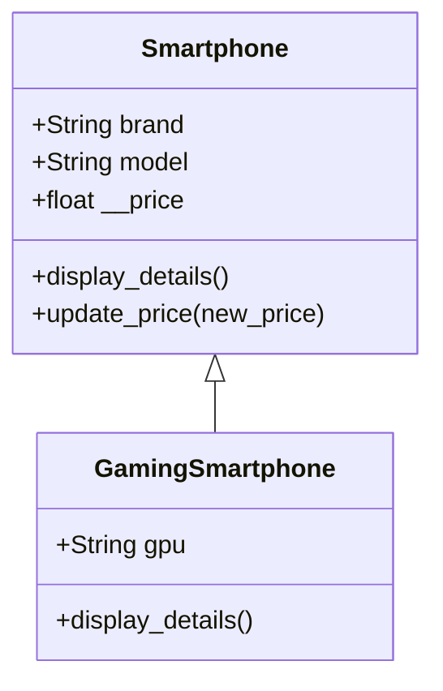
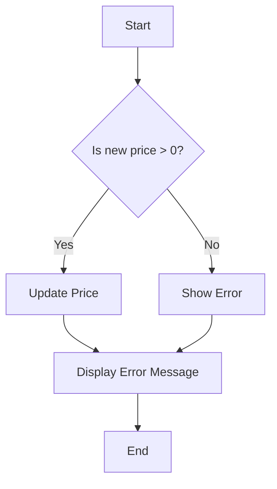
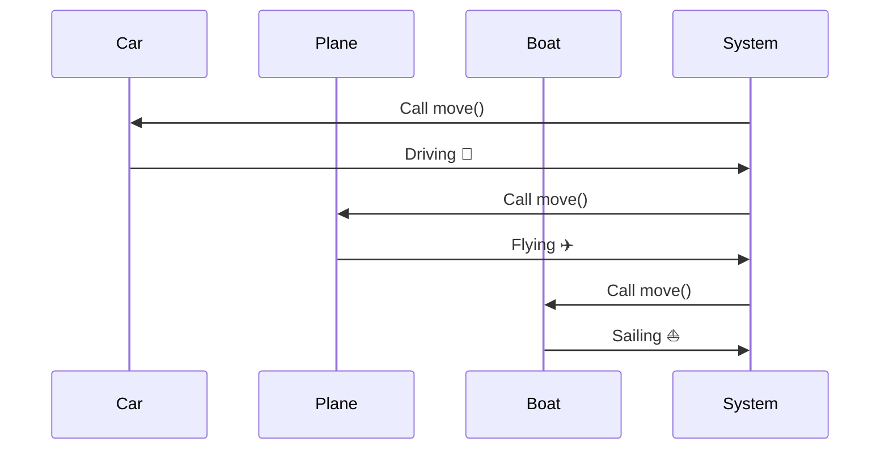

# Week-5-Object-Oriented-Programming-OOP-
## Assignment 1: Design Your Own Class! 🏗️
-** Create a class representing anything you like (a Smartphone, Book, or even a Superhero!).
-** Add attributes and methods to bring the class to life!
-** Use constructors to initialize each object with unique values.
-** Add an inheritance layer to explore polymorphism or encapsulation.
## Activity 2: Polymorphism Challenge! 🎭
-** Create a program that includes animals or vehicles with the same action (like move()). However, make each class define move() differently (for example, Car.move() prints "Driving" 🚗, while Plane.move() prints "Flying" ✈️).

Here's a creative and unique README.md file for the code, incorporating Mermaid diagrams and a flowchart:


# 🚀 OOP Concepts: Smartphone and Vehicle Simulation 📱✈️

Welcome to the OOP (Object-Oriented Programming) example that demonstrates **encapsulation**, **inheritance**, and **polymorphism** through a simulation of **smartphones** and **vehicles**. In this project, we design a basic class structure for **Smartphones** and extend it to a specialized class for **GamingSmartphones**. We also showcase polymorphism through different types of **Vehicles**.

## 📱 **Smartphone Class & Inheritance**

The code showcases a base `Smartphone` class that demonstrates **encapsulation** (private attributes) and includes an `update_price` method to modify the price. A specialized `GamingSmartphone` class extends the `Smartphone` class, adding more specific attributes, like the **GPU**.

### Class Diagram

### Flowchart of Smartphone Price Update


### 🚗 Vehicle Polymorphism
In the second part of the code, we explore polymorphism with a base Vehicle class. We define three subclasses: Car, Plane, and Boat, each overriding the move() method to exhibit different behaviors.

### Polymorphism Flow


### Polymorphism Explanation
The base class Vehicle defines the method move() without implementation, leaving it to the subclasses to implement their own version of move(). Each subclass—Car, Plane, and Boat—provides a unique implementation. When we iterate over a list of these vehicles and call move(), the appropriate method is executed for each subclass, demonstrating polymorphism.

## 💡 Key Concepts Covered
Encapsulation: Private attribute (__price) in the Smartphone class, only modified via the update_price method.
Inheritance: GamingSmartphone inherits from Smartphone, extending its functionality.
Polymorphism: Different move() implementations for Car, Plane, and Boat demonstrate polymorphism in action.
## 🚀 How to Run
Clone this repository:
```bash
git clone https://github.com/yourusername/smartphone-vehicle-oop.git
```
Navigate to the project directory:
```bash
cd smartphone-vehicle-oop
```

Run the code using Python:
```bash
python main.py
```
📝 Output
When you run the code, you will see the following output:

```text
Smartphone: Apple iPhone 15, Price: $1200
Smartphone: Asus ROG Phone 6, Price: $1500, GPU: Adreno 730
Smartphone: Apple iPhone 15, Price: $1100
```

Driving 🚗
Flying ✈️
Sailing ⛵
## 🔧 Future Improvements
Implement more specialized smartphone types (e.g., BusinessSmartphone, CameraSmartphone).
Add more vehicles to the polymorphism example, like Bicycle or Train.
Enhance the UI for displaying vehicle and smartphone details in a web application.
## 🤝 Contributions
Feel free to fork, modify, and contribute! Open an issue or submit a pull request if you have suggestions for improvements.

# Made with ❤️ by [[Brian Kimemia Njeri](https://briankimemia.vercel.app/)]

### Explanation:
- **Class Diagram**: Shows the relationship between `Smartphone` and `GamingSmartphone` using **Mermaid** syntax.
- **Flowchart**: Visualizes the flow of updating a smartphone's price, including decision-making (whether the price is valid).
- **Polymorphism Sequence Diagram**: Demonstrates how polymorphism works in the vehicle example by showing how the system interacts with each vehicle to call the `move()` method.
- **Key Concepts**: Highlights the key OOP concepts demonstrated in the project (Encapsulation, Inheritance, and Polymorphism).
- **Instructions**: Provides steps for running the code and an example of the output.

This `README.md` combines creative diagrams and clear explanations to make the content both informative and visually appealing!


